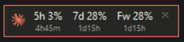

# Claude Usage Widget

A tiny always-on-top widget for the Windows desktop corner that shows your
real Claude subscription usage — the same numbers as the `/usage` panel in
Claude Code: **Session (5hr)**, **Weekly (7 day)**, and per-model weekly limits.

## How it works

Data sources, in order:

1. **Live** — calls the official usage API (`api.anthropic.com/api/oauth/usage`)
   using the OAuth token Claude Code already stores at
   `~/.claude/.credentials.json`. The token is read and used locally only.
2. **Fallback** — if the API call fails (e.g. token expired), it reads the
   `cachedUsageUtilization` blob Claude Code keeps in `~/.claude.json`.
   The expanded view shows `live` or `cached HH:MM` so you always know.

These are **real official numbers**, not estimates.

## Requirements

- Windows
- Python 3 (tkinter included in the standard installer; no third-party packages)
- Claude Code installed and logged in (any subscription plan)

Works for **any user** — it reads from the current user's own home directory,
so just copy this folder to another machine and run it.

## Usage

| Action | Result |
|---|---|
| Double-click `start_claude_usage.vbs` | Start silently (no console) |
| Left-click widget | Toggle compact ⇄ expanded view |
| Drag | Move the widget |
| Right-click | Quit |

**Start on boot:** create a shortcut to `start_claude_usage.vbs` in the
Startup folder (`Win+R` → `shell:startup`).

## Files

- `claude_usage.py` — the widget (Python + tkinter, stdlib only)
- `start_claude_usage.vbs` — silent launcher
- `config.json` — settings (auto-created on first run)

## Settings (`config.json`)

| Key | Description | Default |
|---|---|---|
| `refresh_seconds` | Refresh interval in seconds | 60 |
| `opacity` | Window opacity 0–1 | 0.95 |
| `margin` | Margin from the bottom-right corner (px) | 16 |
| `taskbar_height` | Taskbar height to avoid (px) | 48 |

Edit, save, then restart the widget.
