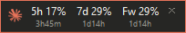
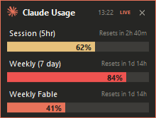
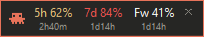
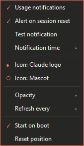

# Claude Usage Widget

A tiny always-on-top widget for the Windows desktop corner that shows your
real Claude subscription usage — the same numbers as the `/usage` panel in
Claude Code: **Session (5hr)**, **Weekly (7 day)**, and per-model weekly limits.

Collapsed, it's a single unobtrusive row. Double-click to expand into gauges.
Pure Python standard library + tkinter — **no third-party packages, no API key**.

**Collapsed**

**Expanded**

The percentage/gauge turns **amber above 50%** and **red above 80%**.

**Mascot** — click the icon to switch between the Claude logo and an animated pixel mascot

**Settings** — click the ⚙ gear for a themed menu

## Features

- **Real official numbers** — the same usage the `/usage` panel shows, not estimates.
- **Account-wide & cross-device** — reflects usage from your phone or any other
  device, as long as this PC is online.
- **Stays fresh on its own** — auto-refreshes the OAuth token, so it keeps
  working even if you haven't opened Claude Code in a while.
- **Color-coded** — the percentage/gauge turns **amber above 50%** and
  **red above 80%** so a tight limit is obvious at a glance.
- **Notifications** — a self-drawn toast pops when you cross a threshold or
  when the 5-hour session resets (see below).
- **Settings menu** — click the gear to toggle everything without touching a file.
- **Switchable icon** — Claude logo or an animated pixel mascot.

## Usage

| Action | Result |
|---|---|
| Double-click `start_claude_usage.vbs` | Start silently (no console window) |
| Double-click the widget | Toggle collapsed ⇄ expanded |
| Click the icon | Switch between the Claude logo and the animated mascot |
| Click the ⚙ gear | Open the settings menu |
| Drag | Move the widget (it stays where you drop it) |
| Click the ✕ | Quit |

## Settings menu (⚙ gear)

A themed menu — no config file editing needed. Every choice is saved to
`config.json` and applied immediately.

- **Usage notifications** — master on/off for toasts
- **Alert on session reset** — notify when the 5-hour window resets
- **Test notification** — fire a sample toast
- **Notification time** — how long a toast stays (3 / 6 / 10 / 15 s, or
  **Until dismissed** to keep it up until you click it)
- **Icon** — Claude logo or Mascot
- **Opacity** — 100 % … 70 %
- **Refresh every** — 30 s / 1 / 2 / 5 min
- **Start on boot** — add/remove the login shortcut
- **Reset position** — snap back to the bottom-right corner

## Notifications

Self-drawn toasts (themed to match the widget, so they show regardless of
Windows notification settings or Focus Assist) fire when:

- a limit crosses **80 %** or **95 %** (configurable), so you don't hit the
  wall unexpectedly, and
- your **5-hour session resets**.

Each toast auto-dismisses after a few seconds, or stays until you click it
(**Notification time → Until dismissed**). The last-seen percentages are
remembered across restarts (`alert_state.json`), so a crossing during a
restart isn't missed.

Prefer to test visibility standalone? Run `python test_notify.py` — it shows
three sample toasts stacked at the bottom-right.

## How it works

Data sources, in order:

1. **Live** — calls the official usage API (`api.anthropic.com/api/oauth/usage`)
   using the OAuth token Claude Code already stores at
   `~/.claude/.credentials.json`. When the access token is near expiry the
   widget refreshes it with the stored refresh token and writes it back (so
   Claude Code stays in sync). The token never leaves your machine.
2. **Fallback** — if a fresh call can't be made (rate-limited, offline), it
   shows the **last successful live result** with the time it was fetched. If
   no live call has ever succeeded this session, it reads the
   `cachedUsageUtilization` blob Claude Code keeps in `~/.claude.json`.

The expanded view shows a **`LIVE`** / **`CACHED`** indicator next to the
fetch time so you always know how fresh the numbers are.

> The usage endpoint is shared with Claude Code itself and rate-limits
> aggressively, so the widget only refreshes live every few minutes and backs
> off further on rate limits — showing the last known numbers in between.

## Requirements

- Windows
- Python 3 (tkinter is included in the standard installer; no third-party packages)
- Claude Code installed and logged in (any subscription plan)

Works for **any user** — it reads from the current user's own home directory,
so just copy this folder to another machine and run it.

## Files

- `claude_usage.py` — the widget (Python + tkinter, stdlib only)
- `start_claude_usage.vbs` — silent launcher (uses `pythonw`, no console)
- `test_notify.py` — standalone notification tester
- `config.json` — settings (auto-created on first run)

## Settings (`config.json`)

Most of these are exposed in the gear menu; the table is the full list.

| Key | Description | Default |
|---|---|---|
| `refresh_seconds` | UI refresh interval in seconds | 60 |
| `opacity` | Window opacity 0–1 | 1.0 |
| `margin` | Margin from the bottom-right corner (px) | 16 |
| `taskbar_height` | Taskbar height to avoid (px) | 48 |
| `border` | Coral border thickness (px) | 1 |
| `icon_style` | `logo` or `mascot` | logo |
| `notify` | Windows toast notifications on/off | true |
| `notify_thresholds` | Percentages that trigger an alert | [80, 95] |
| `notify_reset` | Notify when the 5-hour session resets | true |
| `notify_seconds` | How long a toast stays on screen (seconds) | 6 |
| `notify_sticky` | Keep toasts until dismissed (overrides `notify_seconds`) | false |

**Start on boot** is handled by the menu (it creates a shortcut in
`shell:startup`), so there's no config key for it.

## License

MIT — see [LICENSE](LICENSE).
